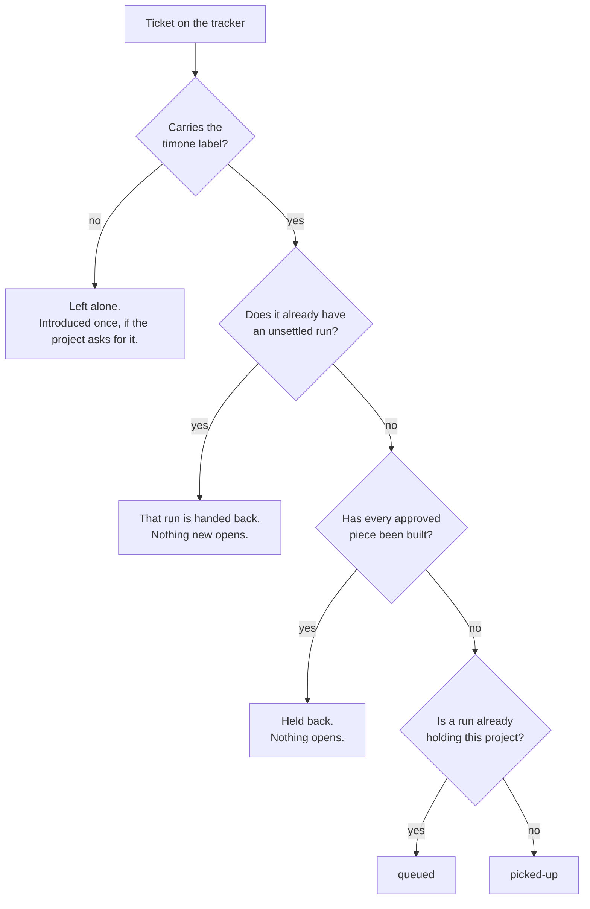
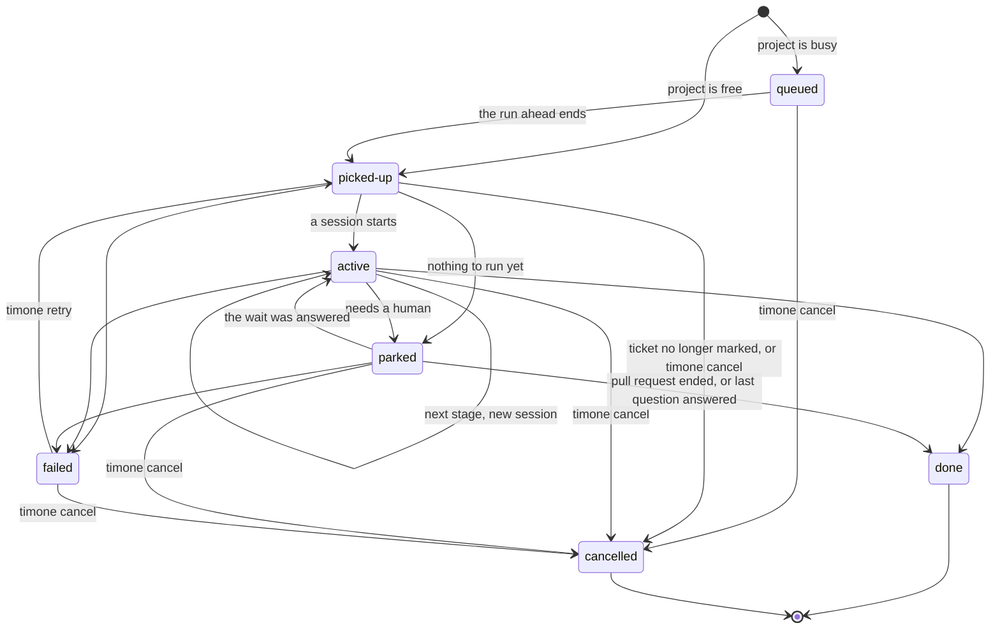
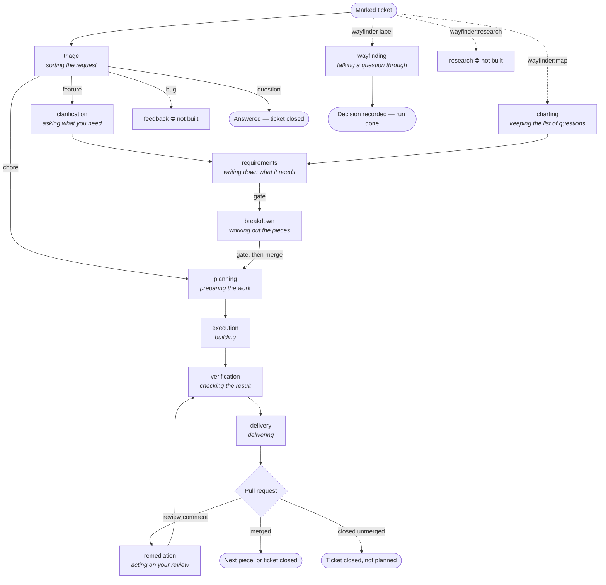
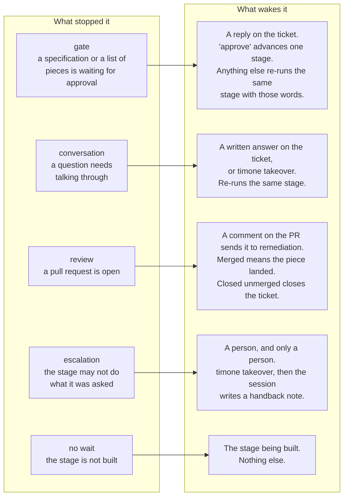

# How the daemon works

The daemon watches the issue trackers of every project in `timone.yaml`. Once a
minute it looks at what changed, and moves work forward by one step. This page
says what the steps are, what state each piece of work can be in, and what makes
it move.

Nothing here is new behaviour. It is the behaviour that today lives in
`src/daemon/`, written down in one place.

## The four things that hold state

| | What it is | Where it lives |
|---|---|---|
| **Ticket** | A conversation with a person. It outlives the work done under it. | The issue tracker |
| **Run** | One piece of work on that ticket: its own branch, its own pull request. | The ledger (`.timone/state.json`) |
| **Stage** | How far along the process the run has got. One stage is one agent session. | On the run |
| **Wait** | What a stopped run is waiting for — and so what will start it again. | On the run |

A run's full state is those last three together: **status + stage + wait**. Read
one alone and you will be wrong about the other two. A run that is `parked` at
`delivery` waiting on a `review` is a finished piece of work sitting in a pull
request. A run that is `parked` at `delivery` waiting on an `escalation` is
stuck and needs a person at a terminal.

Words: a ticket is a conversation, a run is a **chunk** of it
([ADR-0026](adr/0026-a-ticket-is-a-conversation-a-run-is-a-chunk.md)). The human
never sees the word chunk — they read *"piece 2 of 4"*.

## 1. From ticket to run

Rules behind the diagram:

- **Only marked tickets.** The label is `timone`. Everything else is invisible
  to the pickup path.
- **One run per ticket at a time.** Re-reading the same marked ticket every
  minute never doubles it.
- **A new run opens only when the last one settled** — `done` or `cancelled`. A
  `failed` run is *not* settled: it holds its ticket, and `timone retry` is the
  road back. This is deliberate; see
  [ADR-0029](adr/0029-a-chunk-advances-only-on-success.md).
- **Where the new run enters the process:**

  | Situation | Entry stage |
  |---|---|
  | First run, ordinary ticket | `triage` |
  | First run, `wayfinder:research` | `research` |
  | First run, `wayfinder:grilling` / `prototype` / `task` | `wayfinding` |
  | First run, `wayfinder:map` | `charting` |
  | Second run onward | `planning` |

  A second run skips straight to planning because the specification and the list
  of pieces were approved and merged during the first one.

## 2. The run status machine

Read `TRANSITIONS` in `src/daemon/runs.ts` for the same table in code. Anything
not drawn above throws.

| Status | Meaning | What it holds | How it leaves |
|---|---|---|---|
| `queued` | Waiting behind another run on the same project. | nothing | The run ahead ends. |
| `picked-up` | Registered, session not started yet. | the project | A session starts, or nothing can run. |
| `active` | A session is running, or a terminal has taken it over. | the project | The session ends. |
| `parked` | Stopped, waiting on something. **Not terminal.** | the project, if it owns a branch | An answer, a merge, or a person. |
| `done` | Finished. | nothing | Dead end. |
| `failed` | Broke. | nothing | `timone retry` or `timone cancel`. |
| `cancelled` | Abandoned. | nothing | Dead end, on purpose. |

Two points that are easy to get wrong:

- **`parked` is not an ending.** It is the normal state of a run waiting for a
  person. Most of a run's wall-clock life is spent here.
- **`cancelled` is not `failed`.** A failure can be re-armed with one keystroke;
  work that should never have existed must not be. Cancelling also *settles* the
  chunk, so the ticket is free to open a fresh one — which is what makes a
  re-opened ticket self-healing.

## 3. The stage graph

| Stage | What the human is told it is | process.md | Waits on | Owns a branch | Next | Built |
|---|---|---|---|---|---|---|
| `triage` | sorting the request | 1 | — | no | by classification | yes |
| `clarification` | asking what you need | 2 | conversation | no | `requirements` | yes |
| `wayfinding` | talking a question through | 2 | conversation | no | — (run ends) | yes |
| `charting` | keeping the list of questions | 2 | conversation | no | `requirements` | yes, no session |
| `research` | looking something up | 2 | — | no | — | **no** |
| `requirements` | writing down what it needs | 3 | gate | yes | `breakdown` | yes |
| `breakdown` | working out the pieces | 5 | gate | yes | `planning` | yes |
| `planning` | preparing the work | 5 | — | yes | `execution` | yes |
| `execution` | building | 6 | — | yes | `verification` | yes |
| `verification` | checking the result | 7 | — | yes | `delivery` | yes |
| `delivery` | delivering | 8 | review | yes | — (the PR ends it) | yes |
| `remediation` | acting on your review | 9 | — | yes | `verification` | yes |
| `feedback` | looking into what went wrong | 9 | — | no | — | **no** |

The table is `STAGES` in `src/daemon/pipeline.ts`. It is data, not code: the
daemon orchestrates the stage skills and never reimplements them.

Every session runs on Opus 5 except `triage` (Sonnet 5) and the short
approval-recording session (Haiku 4.5), which is not a stage.

**Two gates, and only two.** The human approves the specification, and approves
the list of pieces. Everything after that is judged by the pull request. A gate
over an empty branch fails the run rather than asking for a signature on a
blank.

**Approving the breakdown does two things at once.** It stamps the artifact, and
it merges that branch into the default branch with no pull request
([ADR-0030](adr/0030-the-breakdown-is-a-stage-and-chunk-zero-merges-without-a-pull-request.md)).
Every later piece is cut from a default branch that already carries the
specification.

## 4. What stops a run, and what starts it again

Every stop writes a **wait kind** on the run. The wait kind is the whole of what
the daemon will accept as an answer.

Rules that make the waits safe:

- **Shape, not sentiment, at a gate.** A reply whose first line *is* an approval
  word approves. Everything else is a change request carrying the exact words.
  "approve once you fix the wording" is a change request.
- **Timone can never answer its own question.** Its comments carry a machine
  marker and are skipped. It posts through the human's account, so the author is
  no help.
- **Every wait has a cursor** — the instant the question was asked. Only what
  was written strictly after it can answer it. An "approve" said earlier about
  something else cannot approve this.
- **Reading an answer consumes it.** The cursor moves before the session starts,
  so no second reader finds the same answer outstanding.
- **An escalation is not a handoff.** A handoff waits for a reply and resumes on
  one. An escalation waits for a person, because the stage already read the
  reply and was right about it. Writing again will not move it, and the ticket
  says so.
- **Two re-asks and it escalates itself.** A stage that read an answer and asked
  the same question again, twice running, is stopped by the machinery whether or
  not it noticed. This is
  [ADR-0033](adr/0033-a-stage-that-cannot-act-on-an-answer-escalates.md)'s floor.

## 5. One poll cycle, in order

The order matters. Each step is written where it is because of something that
went wrong when it was elsewhere.

1. **Apply what humans asked for.** `timone retry`, `cancel` and `takeover` do
   not write the ledger while the daemon holds it — they leave a request file,
   and the daemon carries it out here. First, so a retry does not wait a whole
   cycle. ([ADR-0032](adr/0032-a-human-command-asks-the-daemon-to-act.md))
2. **Witness.** Record that a daemon was watching, once for the whole cycle. A
   run is only judged dead if somebody was listening throughout.
   ([ADR-0020](adr/0020-liveness-is-judged-only-over-witnessed-time.md))
3. Then, per project:
   1. **Reclaim dead runs.** A run left `active` by a daemon that died is
      holding its project. If its pull request merged in the meantime, that
      counts — the merge is the human's and does not need the machine alive to
      be true.
   2. **Register marked tickets.** New runs are picked up or queued, and told so
      on the ticket.
   3. **Open go-aheads.** A map whose questions are all closed gets its one
      question asked.
   4. **Resume answered runs.** One per project per cycle, because sessions
      serialize.
   5. **Spawn.** If the project's occupying run is `picked-up`, start its
      session — after checking the ticket is still marked and open.
   6. **Reconcile the calls to action.** Last, so a ticket that moved this cycle
      says so this cycle.
   7. **Introduce.** Say hello on unmarked tickets, where the project asks for
      it. Once each, ever.
   8. **Reconcile previews.** After the run states settle, so a merged pull
      request's preview is released on the same cycle.

An error anywhere inside a project's turn is caught, logged, and the next
project still runs.

## 6. Who holds the project

**One session at a time per project.** Two agents in one working copy is the
thing this rule exists to prevent.

A run holds its project when:

- its status is `picked-up` or `active`, **or**
- it is `parked` *and owns a work branch*.

So a run parked at a gate on a branch keeps the project. A run parked on a
conversation before any branch was cut does not — another ticket can be worked
while the human thinks.

Anything registered while a project is held is `queued`, and promoted when the
holder ends.

## 7. What the ticket says, per state

Computed once, in `ctaFor`, and rendered by both the ticket comment and
`timone status`. The two can never disagree because there is one computation.

| Run state | Headline | What moves it |
|---|---|---|
| no run, unmarked | "I'm not working on this one." | add the `timone` label |
| no run, marked | "I'll pick this up on my next pass." | nothing |
| `queued` | "This one is in the queue." | nothing |
| `picked-up` / `active` | "Building piece 2 of 4." | nothing |
| `parked`, gate | "This one is waiting on you." | a reply on the ticket |
| `parked`, conversation | "This one is waiting on you." | a reply, or `timone takeover` |
| `parked`, review | "The work is open as a pull request." | your review |
| `parked`, escalation | "I can't take this one further myself." | `timone takeover` |
| `parked`, no wait | "That's as far as I can take this one for now." | the stage being built |
| `parked`, map working | "I'm working through this map's questions." | nothing |
| `parked`, map ready | "Every question on this map is answered." | say go ahead |
| `done`, pieces left | "Piece 3 is next." | nothing |
| `done`, no pieces left | "This one is finished." | nothing |
| `failed` | "Something went wrong while I was working on this." | `timone retry` |
| `failed`, network or login | "I could not reach the service I run on." | fix it, then `timone retry` |
| `cancelled` | "I stopped work on this one." | nothing — a fresh run starts next pass |

## 8. Where the model is uneven

Written down because the point of drawing the machine is to see where it does
not close. None of these is breaking anything today.

1. **One of the four triage classes goes nowhere.** A `bug` is routed to
   `feedback`, and `feedback` is `built: false`. So every bug ticket is triaged,
   advances, and parks on "That's as far as I can take this one for now" — for
   ever. `research` is the same. Both are honest in the code; the practical
   effect is that bugs cannot be worked by the daemon at all.

2. **The list of pieces is read from the working checkout.** `initiativeProgress`
   and `successionOf` read `projects/<name>/doc/plans/breakdowns/ticket-NN.md`
   from whatever the working tree currently has checked out — not from a named
   ref. After the breakdown merges into the default branch this is reliable.
   Before it merges, the file only exists on the run's branch, so "which piece
   is next" depends on what the last session left checked out. Two surfaces read
   it: the ticket's call to action and `timone status`.

3. **"Chunk zero" has no number.** ADR-0030 names the specification-and-breakdown
   work chunk zero, but it is not a run of its own: it happens inside run
   `seq: 1`, which then goes on to build piece 1 on the same branch. So `seq`
   counts pieces and chunk zero is not counted. Nothing is broken; the word does
   not match the ledger.

4. **A failed run keeps its wait; a cancelled one does not.** `fail()` clears
   `waitingOn` but leaves `waitingKind` and `waitCursor` behind. `cancel()`
   clears all three. Nothing reads a failed run's wait, and `retry` clears it a
   moment later, so this is harmless — but the two endings record different
   things for no stated reason.

5. **A handback to a real-but-unbuilt step is reported as a misread name.** If a
   session writes "carry on at *looking something up*", the daemon refuses —
   correctly, nothing can run that step — but the ticket then says *"I wrote down
   'looking something up' and I don't know what that means."* The name is
   perfectly well defined. The message is wrong about why it was refused.

## Where this lives in the code

| Concern | File |
|---|---|
| Run statuses and their legal transitions | `src/daemon/runs.ts` |
| The stage graph, waits, models | `src/daemon/pipeline.ts` |
| The poll cycle | `src/daemon/poll.ts` |
| Running one stage, and judging how it ended | `src/daemon/session.ts` |
| Reading a gate reply or a written answer | `src/daemon/gates.ts` |
| Reading how a stage said it ended | `src/daemon/outcomes.ts` |
| What a ticket says it needs | `src/daemon/cta.ts` |
| The list of pieces | `src/daemon/breakdown.ts` |
| Human commands left for the daemon | `src/daemon/requests.ts` |
