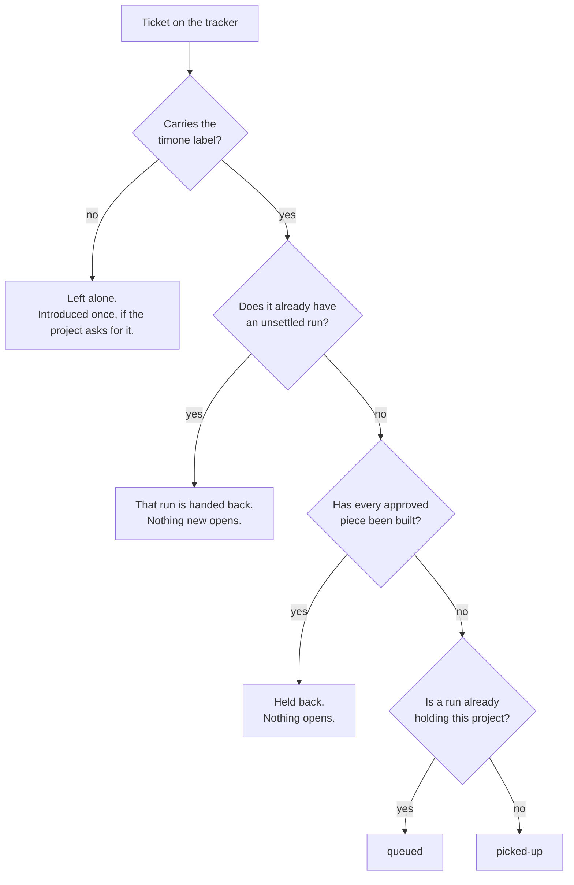
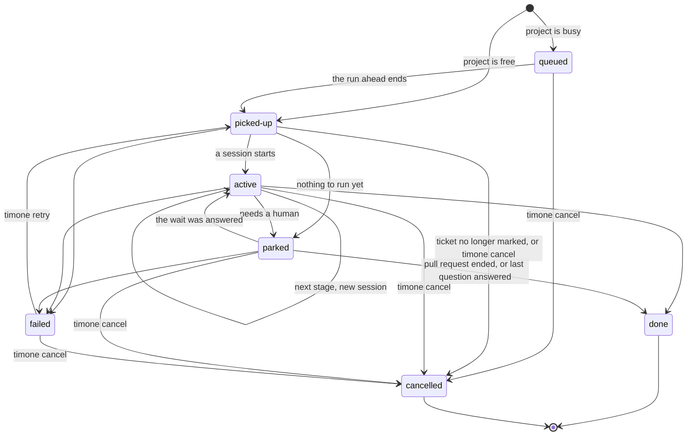
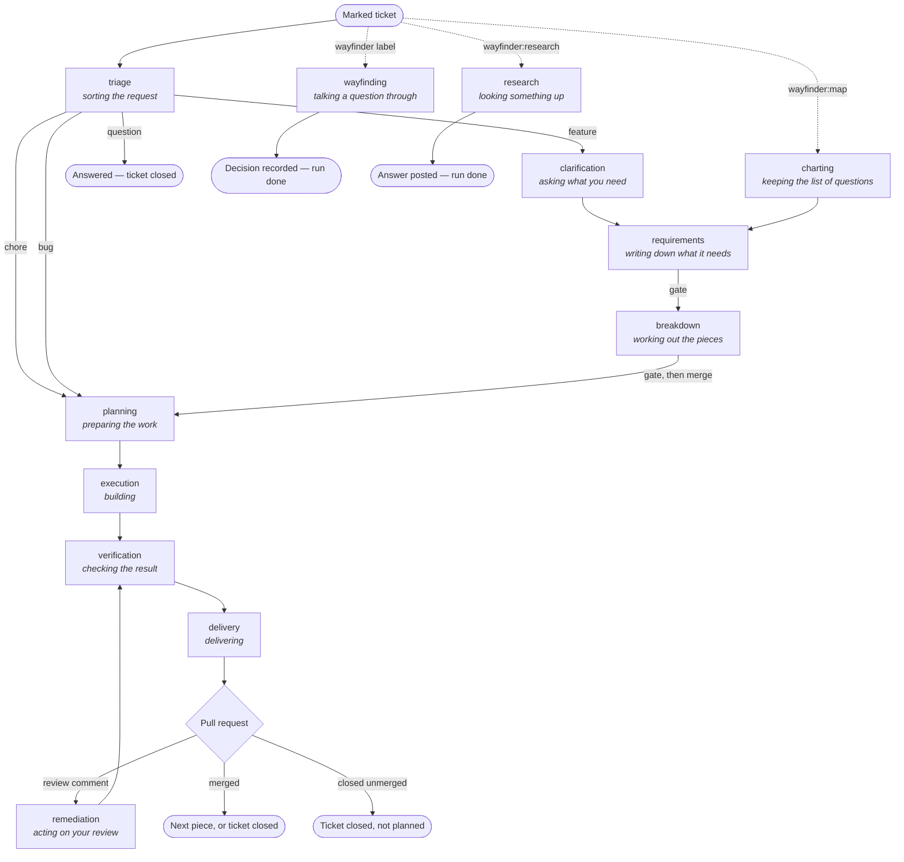
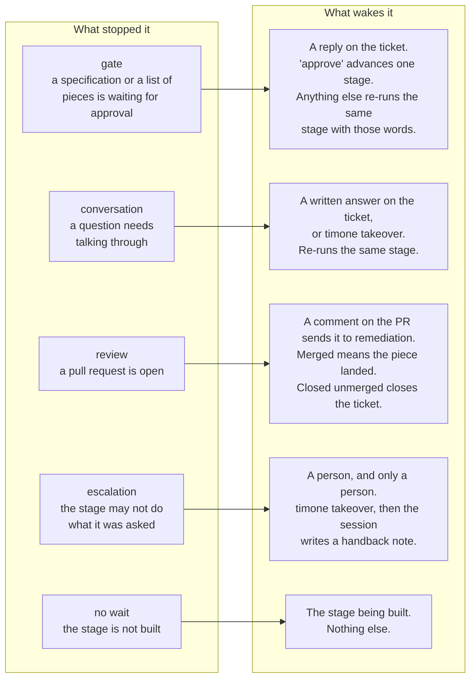

# How the daemon works

The daemon watches the issue trackers of every project in `timone.yaml`. Once a
minute it looks at what changed, and moves work forward by one step. This page
says what the steps are, what state each piece of work can be in, and what makes
it move.

Nothing here is new behaviour. It is the behaviour that today lives in
`src/daemon/`, written down in one place.

## The four things that hold state

| | What it is | Where it lives |
|---|---|---|
| **Ticket** | A conversation with a person. It outlives the work done under it. | The issue tracker |
| **Run** | One piece of work on that ticket: its own branch, its own pull request. | The ledger (`.timone/state.json`) |
| **Stage** | How far along the process the run has got. One stage is one agent session. | On the run |
| **Wait** | What a stopped run is waiting for — and so what will start it again. | On the run |

A run's full state is those last three together: **status + stage + wait**. Read
one alone and you will be wrong about the other two. A run that is `parked` at
`delivery` waiting on a `review` is a finished piece of work sitting in a pull
request. A run that is `parked` at `delivery` waiting on an `escalation` is
stuck and needs a person at a terminal.

Words: a ticket is a conversation, a run is a **chunk** of it
([ADR-0026](../doc/adr/0026-a-ticket-is-a-conversation-a-run-is-a-chunk.md)). The human
never sees the word chunk — they read *"piece 2 of 4"*.

## 1. From ticket to run



Rules behind the diagram:

- **Only marked tickets.** The label is `timone`. Everything else is invisible
  to the pickup path.
- **One run per ticket at a time.** Re-reading the same marked ticket every
  minute never doubles it.
- **A new run opens only when the last one settled** — `done` or `cancelled`. A
  `failed` run is *not* settled: it holds its ticket, and `timone retry` is the
  road back. This is deliberate; see
  [ADR-0029](../doc/adr/0029-a-chunk-advances-only-on-success.md).
- **Where the new run enters the process:**

  | Situation | Entry stage |
  |---|---|
  | First run, ordinary ticket | `triage` |
  | First run, `wayfinder:research` | `research` |
  | First run, `wayfinder:grilling` / `prototype` / `task` | `wayfinding` |
  | First run, `wayfinder:map` | `charting` |
  | Second run onward | `planning` |

  A second run skips straight to planning because the specification and the list
  of pieces were approved and merged during the first one.

## 2. The run status machine



Read `TRANSITIONS` in `src/daemon/runs.ts` for the same table in code. Anything
not drawn above throws.

**✏ 2026-08-21 — which ticket number `timone retry` and `timone cancel` take.**
Since [ADR-0044](../doc/adr/0044-a-run-belongs-to-a-step-ticket-and-the-assignee-is-what-holds-it.md)
D1 a run belongs to a **step ticket**, not to the job you filed. So the commands
name a step:

```
timone retry scratch-app#46      # the step, not the job it belongs to
timone cancel scratch-app#46
```

`timone status` prints the step number beside its place in the job — for example
`#46 (step 1 of 3 of #45)` — so the number to type is the one on screen.

| Status | Meaning | What it holds | How it leaves |
|---|---|---|---|
| `queued` | Waiting behind another run on the same project. | nothing | The run ahead ends. |
| `picked-up` | Registered, session not started yet. | the project | A session starts, or nothing can run. |
| `active` | A session is running, or a terminal has taken it over. | the project | The session ends. |
| `parked` | Stopped, waiting on something. **Not terminal.** | the project, if it owns a branch | An answer, a merge, or a person. |
| `done` | Finished. | nothing | Dead end. |
| `failed` | Broke. | nothing | `timone retry` or `timone cancel`. |
| `cancelled` | Abandoned. | nothing | Dead end, on purpose. |

Two points that are easy to get wrong:

- **`parked` is not an ending.** It is the normal state of a run waiting for a
  person. Most of a run's wall-clock life is spent here.
- **`cancelled` is not `failed`.** A failure can be re-armed with one keystroke;
  work that should never have existed must not be. Cancelling *settles* the
  chunk, so an ordinary ticket is free to open a fresh one — which is what makes
  a re-opened ticket self-healing.

  **✏ 2026-08-21 — a *step* is the exception, and it is the common case now.**
  Under [ADR-0040](../doc/adr/0040-one-step-is-one-ticket-and-doneness-is-a-fact-about-a-ticket.md)
  each piece of a job is its own ticket. When the machine starts one it puts the
  `timone:held` label on it, and cancelling leaves that label there. A held step
  is one the machine will **not** take up again
  ([ADR-0044](../doc/adr/0044-a-run-belongs-to-a-step-ticket-and-the-assignee-is-what-holds-it.md)
  D2). There are two ways on, and the ticket says both: remove the label and it
  starts afresh, or close the ticket and the job carries on without that piece.

  **A dropped step does not stop the job finishing.** The job closes saying how
  many pieces were really built — "13 of 14" — and works out which is which from
  whether a pull request was merged. Nothing is asked of you and no label decides
  it.

## 3. The stage graph



| Stage | What the human is told it is | process.md | Waits on | Owns a branch | Next | Built |
|---|---|---|---|---|---|---|
| `triage` | sorting the request | 1 | — | no | by classification | yes |
| `clarification` | asking what you need | 2 | conversation | no | `requirements` | yes |
| `wayfinding` | talking a question through | 2 | conversation | no | — (run ends) | yes |
| `charting` | keeping the list of questions | 2 | conversation | no | `requirements` | yes, no session |
| `research` | looking something up | 2 | — | no | — (run ends) | yes |
| `requirements` | writing down what it needs | 3 | gate | yes | `breakdown` | yes |
| `breakdown` | working out the pieces | 5 | gate | yes | `planning` | yes |
| `planning` | preparing the work | 5 | — | yes | `execution` | yes |
| `execution` | building | 6 | — | yes | `verification` | yes |
| `verification` | checking the result | 7 | — | yes | `delivery` | yes |
| `delivery` | delivering | 8 | review | yes | — (the PR ends it) | yes |
| `remediation` | acting on your review | 9 | — | yes | `verification` | yes |

The table is `STAGES` in `src/daemon/pipeline.ts`. It is data, not code: the
daemon orchestrates the stage skills and never reimplements them.

Every session runs on Opus 5 except `triage` (Sonnet 5) and the short
approval-recording session (Haiku 4.5), which is not a stage.

**Two gates, and only two.** The human approves the specification, and approves
the list of pieces. Everything else is judged by the pull request. A gate
over an empty branch fails the run rather than asking for a signature on a
blank.

**Approving the breakdown does two things at once.** It stamps the artifact, and
it merges that branch into the default branch with no pull request
([ADR-0030](../doc/adr/0030-the-breakdown-is-a-stage-and-chunk-zero-merges-without-a-pull-request.md)).
Every later piece is cut from a default branch that already carries the
specification.

## 4. What stops a run, and what starts it again

Every stop writes a **wait kind** on the run. The wait kind is the whole of what
the daemon will accept as an answer.



Rules that make the waits safe:

- **Shape, not sentiment, at a gate.** A reply whose first line *is* an approval
  word approves. Everything else is a change request carrying the exact words.
  "approve once you fix the wording" is a change request.
- **Timone can never answer its own question.** Its comments carry a machine
  marker and are skipped. It posts through the human's account, so the author is
  no help.
- **Every wait has a cursor** — the instant the question was asked. Only what
  was written strictly after it can answer it. An "approve" said earlier about
  something else cannot approve this.
- **Reading an answer consumes it.** The cursor moves before the session starts,
  so no second reader finds the same answer outstanding.
- **An escalation is not a handoff.** A handoff waits for a reply and resumes on
  one. An escalation waits for a person, because the stage already read the
  reply and was right about it. Writing again will not move it, and the ticket
  says so.
- **Two re-asks and it escalates itself.** A stage that read an answer and asked
  the same question again, twice running, is stopped by the machinery whether or
  not it noticed. This is
  [ADR-0033](../doc/adr/0033-a-stage-that-cannot-act-on-an-answer-escalates.md)'s floor.

### The login a boxed run works on

A boxed run cannot log in by itself, so the daemon hands it a token when it
starts the container. There are two kinds, and which one you give it decides
whether long runs survive.

**Give the daemon a lasting token.** Run `claude setup-token` once, and start
the daemon in a shell where `CLAUDE_CODE_OAUTH_TOKEN` holds what it printed.
A token from that command outlives any run.

**Without one, the daemon borrows your own login.** It reads it fresh at every
spawn and it works, but it comes with a deadline: the token lives about six
hours counted from when your CLI last refreshed it, not from when the run
starts. A box gets whatever is left, and nothing inside can renew it.

A run that outlives its token is refused mid-sentence and everything it has
done since its last push is lost. That happened on `ivtrends#24` on
2026-08-23 — three hours of work, refused with `401 OAuth access token has
expired`. Two things came out of it
([#55](https://github.com/fvermaut/timone/issues/55)):

- A borrowed token with less than half an hour on it no longer starts a run at
  all. The daemon says so and names `claude setup-token`.
- A run stopped by an expiry is **tried again**, up to three times, without a
  word on the ticket. Only a login that is genuinely refused, or one that
  keeps running out, is put in front of you.

### The forge token a boxed run works on

The daemon mints a GitHub token scoped to the one repository a run is for, and
a minted token dies after an hour. Runs last longer than that.

**The daemon hands a running box a fresh token every twenty minutes.** The box
cannot mint one itself — that needs the App private key, which stays on the
host and never enters a box. Inside, `git` and `gh` both read the token from a
file the daemon rewrites, so a refreshed token takes effect with nothing
restarted.

Before this, a box was given one token when it started and never another.
`ivtrends#24` pushed once, lost its token an hour in, and went on committing
for two more hours into a container that was then destroyed. A whole
sub-phase of work never reached the remote and nothing said so, because a
dead forge token stops no session
([#56](https://github.com/fvermaut/timone/issues/56)).

A refresh that fails does not stop the run — the token already in the box is
still good for a while and the next attempt mends it — but it is written to
the daemon log, because silence is what made this expensive.

**One thing is still not covered.** `GH_TOKEN` is set in the container as the
starting value, so a script that reads that variable by hand, rather than
calling `git` or `gh`, gets the token from when the run started and will see a
401 after an hour.

### The environment a boxed run gets for the project

A boxed run is built from the remotes, so it has what the project commits and
nothing else. That is a problem twice over:

- A project's `.env` is gitignored. The box gets `.env.example`, where every
  secret is empty on purpose.
- The addresses in that template are the **host's** way to reach a service —
  `localhost:5434` for `ivtrends`. Inside the box, `localhost` is the box.

**Put what a run needs in `.timone/env/<project>.env`.** Same format as any
`.env`: `NAME=value`, one per line, `#` for a comment. The daemon reads it at
every spawn, hands the values to the container by name, and writes them into
`projects/<name>/.env` inside the box, on top of the committed template — so
they win, and everything the template declares stays.

For `ivtrends` that file holds the AlphaVantage key and the three connection
strings pointing at `db:5432`, which is where the database beside the box
actually answers.

A missing file is fine. A project that needs no secret and talks to nothing
gets what it always got, and the daemon log says which file it read or did not
find.

Two things are refused, with the line named, before any container starts: a
variable the box sets for itself (`GH_TOKEN`, `TIMONE_PROMPT`, and the rest —
one of those in a project file would redirect the run), and a value carrying a
quote or a backslash, which a shell and dotenv would read differently.

**The box also now says what it is.** Every boxed run's prompt opens with where
its checkouts are, that `docker` is absent on purpose, which services are
running beside it and by what name, and which values were written into `.env`.
Without that, `ivtrends#33` checked for `docker`, found none, checked a port on
`localhost`, found nothing, and reported that no database was running — while a
healthy one answered on the network its own container had joined
([ADR-0045](../doc/adr/0045-a-boxed-runs-project-environment-comes-from-a-file-the-daemon-owns.md)).

## 5. One poll cycle, in order

The order matters. Each step is written where it is because of something that
went wrong when it was elsewhere.

1. **Apply what humans asked for.** `timone retry`, `cancel` and `takeover` do
   not write the ledger while the daemon holds it — they leave a request file,
   and the daemon carries it out here. First, so a retry does not wait a whole
   cycle. ([ADR-0032](../doc/adr/0032-a-human-command-asks-the-daemon-to-act.md))
2. **Witness.** Record that a daemon was watching, once for the whole cycle. A
   run is only judged dead if somebody was listening throughout.
   ([ADR-0020](../doc/adr/0020-liveness-is-judged-only-over-witnessed-time.md))
3. Then, per project:
   1. **Reclaim dead runs.** A run left `active` by a daemon that died is
      holding its project. If its pull request merged in the meantime, that
      counts — the merge is the human's and does not need the machine alive to
      be true.
   2. **Register marked tickets.** New runs are picked up or queued, and told so
      on the ticket.
   3. **Open go-aheads.** A map whose questions are all closed gets its one
      question asked.
   4. **Resume answered runs.** One per project per cycle, because sessions
      serialize.
   5. **Spawn.** If the project's occupying run is `picked-up`, start its
      session — after checking the ticket is still marked and open.
   6. **Reconcile the calls to action.** Last, so a ticket that moved this cycle
      says so this cycle.
   7. **Introduce.** Say hello on unmarked tickets, where the project asks for
      it. Once each, ever.
   8. **Reconcile previews.** After the run states settle, so a merged pull
      request's preview is released on the same cycle.

An error anywhere inside a project's turn is caught, logged, and the next
project still runs.

## 6. Who holds the project

**One session at a time per project.** Two agents in one working copy is the
thing this rule exists to prevent.

A run holds its project when:

- its status is `picked-up` or `active`, **or**
- it is `parked` *and owns a work branch*.

So a run parked at a gate on a branch keeps the project. A run parked on a
conversation before any branch was cut does not — another ticket can be worked
while the human thinks.

Anything registered while a project is held is `queued`, and promoted when the
holder ends.

## 7. What the ticket says, per state

Computed once, in `ctaFor`, and rendered by both the ticket comment and
`timone status`. The two can never disagree because there is one computation.

| Run state | Headline | What moves it |
|---|---|---|
| no run, unmarked | "I'm not working on this one." | add the `timone` label |
| no run, marked | "I'll pick this up on my next pass." | nothing |
| `queued` | "This one is in the queue." | nothing |
| `picked-up` / `active` | "Building piece 2 of 4." | nothing |
| `parked`, gate | "This one is waiting on you." | a reply on the ticket |
| `parked`, conversation | "This one is waiting on you." | a reply, or `timone takeover` |
| `parked`, review | "The work is open as a pull request." | your review |
| `parked`, escalation | "I can't take this one further myself." | `timone takeover` |
| `parked`, no wait | "That's as far as I can take this one for now." | the stage being built |
| `parked`, map working | "I'm working through this map's questions." | nothing |
| `parked`, map ready | "Every question on this map is answered." | say go ahead |
| `done`, pieces left | "Piece 3 is next." | nothing |
| `done`, no pieces left | "This one is finished." | nothing |
| `failed` | "Something went wrong while I was working on this." | `timone retry` |
| `failed`, network | "I could not reach the service I run on." | fix it, then `timone retry` |
| `failed`, login refused | "My login to the service I run on was refused." | fix it, then `timone retry` |
| `failed`, login ran out | "My login ran out while I was working." | fix it, then `timone retry` |
| `cancelled` | "I stopped work on this one." | nothing — a fresh run starts next pass |

## 8. Where the model was uneven

Drawing the machine is what made these visible. All five were fixed in
[phase 27](../doc/plans/phases/phase-27.md); they are kept here because the
reasoning is what stops them coming back.

1. **One of the four triage classes went nowhere.** A `bug` routed to
   `feedback`, and `feedback` had never been built — so every bug ticket was
   triaged, advanced, and parked on *"That's as far as I can take this one for
   now"* for ever. `research` was the same. **Fixed twice.** Phase 27 built both
   stages. Then the live gate showed that the `feedback` stage was doing
   triage's job with the documents open, so
   [ADR-0036](../doc/adr/0036-feedback-is-triage-with-the-documents-open.md)
   retired it: triage now reads before it decides, and a bug goes straight to
   planning. `research` answers on the ticket and ends its own run. Every stage
   the graph can route to runs, and a test asserts that rather than listing them.

2. **The list of pieces was read from the working checkout** — whatever branch a
   session happened to leave behind, which is not a point in the project's
   history at all. **Fixed:** it is read from the default branch, which is where
   approving a breakdown puts it. Before that merge the answer is *absent*,
   which is honest: a breakdown on a work branch is a proposal nobody has
   approved, and counting pieces off one describes a list the human never saw.

3. **"Chunk zero" had no number.** The word named work that is not a run of its
   own. **Fixed:** the glossary defines it — chunk zero is carried by chunk 1,
   chunk numbers count pieces, and the word names the work rather than a row in
   the ledger.

4. **A failed run kept a wait nothing was waiting on.** Failing cleared the
   words and left the kind and the cursor behind. **Fixed:** failing clears the
   whole wait, as cancelling already did. What survives is the marker for an
   answer that was read and never acted on — that is what `timone retry` rewinds
   to, and it is still owed to whoever wrote it.

5. **Two different refusals read as one message.** A handback naming a step
   nobody defined and a handback naming a real step with no session behind it
   both produced *"I don't know what that means"* — which sent a reader off to
   correct a note that had nothing wrong with it. **Fixed:** the second now says
   the step is real and the machine cannot run it yet.

## Where this lives in the code

| Concern | File |
|---|---|
| Run statuses and their legal transitions | `src/daemon/runs.ts` |
| The stage graph, waits, models | `src/daemon/pipeline.ts` |
| The poll cycle | `src/daemon/poll.ts` |
| Running one stage, and judging how it ended | `src/daemon/session.ts` |
| Reading a gate reply or a written answer | `src/daemon/gates.ts` |
| Reading how a stage said it ended | `src/daemon/outcomes.ts` |
| What a ticket says it needs | `src/daemon/cta.ts` |
| The list of pieces | `src/daemon/breakdown.ts` |
| Human commands left for the daemon | `src/daemon/requests.ts` |
