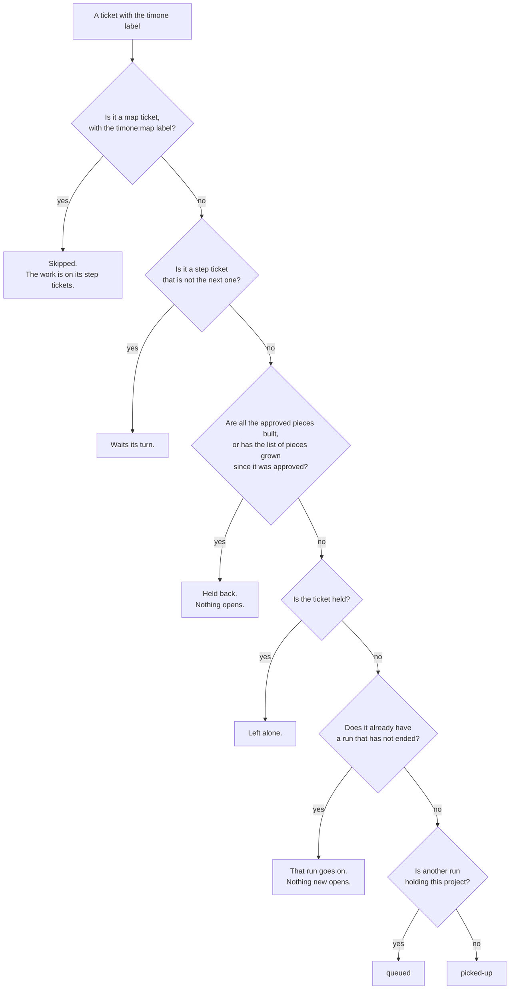
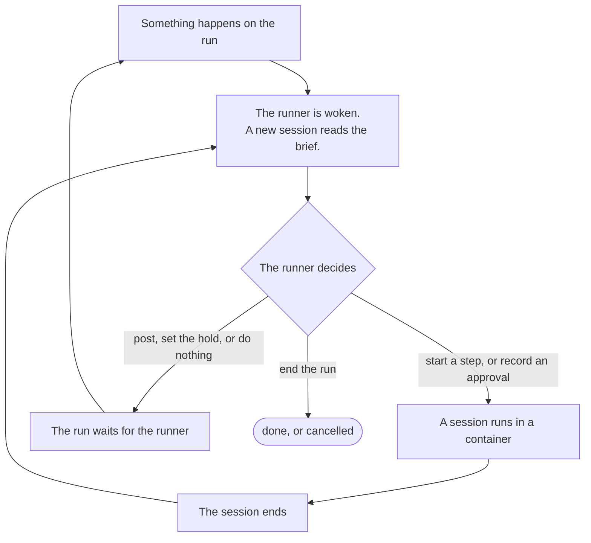
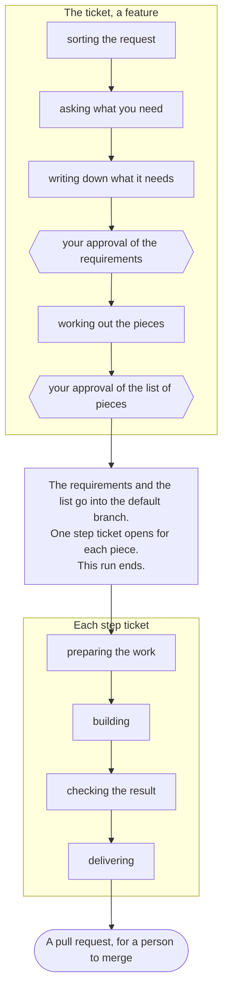
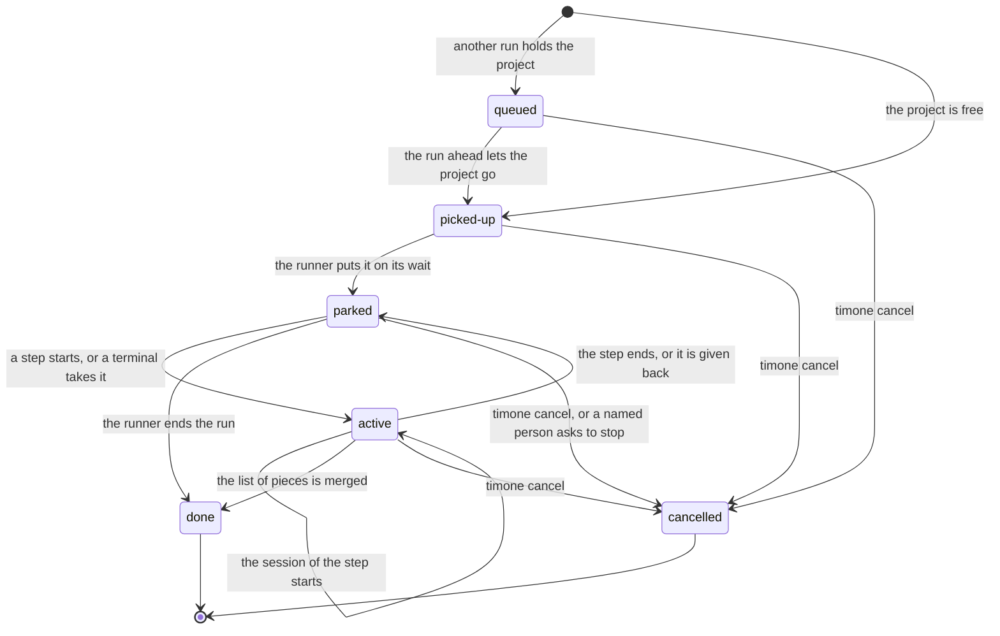

# How the daemon works

The daemon watches the issue trackers of every project in `timone.yaml`. Once a
minute it runs one cycle. In a cycle it picks up new tickets, and for each run
it finds what happened since it last looked. When something did, it wakes the
**runner**. The runner is an agent: it reads the run and decides what happens
next. The order of steps in [process.md](../process.md) is its default, not a
rule.

This page says what one cycle does, how a run moves, what a run waits for, and
what code keeps whatever the runner decides. It describes the code in
`src/daemon/` and `src/runner/` as it is now. The decision behind it is
[ADR-0060](../doc/adr/0060-a-runner-decides-each-step-and-nothing-merges-without-a-persons-yes.md),
and the requirements are
[PRD-05](../doc/specs/prd/prd-05-a-runner-decides-each-step.md).

## The things that hold state

| | What it is | Where it lives |
|---|---|---|
| **Ticket** | A conversation with a person. It outlives the work done under it. | The issue tracker |
| **Run** | One piece of work on that ticket: its status, the step it is at, its branch, its pull request, and what it waits for. | The ledger, `.timone/state.json` |
| **Run record** | What the machine wrote down about the ticket's runs: each step and what it cost, each decision of the runner and its reason, each step left out of the default order. | `.timone/records/<project>/<ticket>.jsonl` |
| **Hold** | The `timone:held` label. A held ticket is not picked up again. | The issue tracker |

A **step** is one agent session that does one part of the process's work, such
as building the code or checking the result. Each step runs in a container. The
code calls a step a *stage*.

**The runner keeps nothing between wakes.** Each wake is a new session. It is
given a brief built again from the ticket, the pull request, the run record and
facts read from the forge. The runner knows nothing that is not in the brief.

## 1. Before the first cycle

`timone daemon` does not start when:

- `timone.yaml` cannot be read. A project entry that still has a `driver` line
  is refused, with one sentence per project that says to delete the line.
- the manifest has no `identity` block. The daemon never works under your own
  forge login ([ADR-0042](../doc/adr/0042-timone-acts-under-its-own-identity.md)).
- a project names nobody who may instruct the runner: no `instructors` on the
  project, and no `operator` at the top of the manifest. The daemon says which
  project, and what to add.
- another daemon holds the lock on the ledger. It says who holds it.

When it starts, it says which model login the steps will use (see
[section 11](#11-what-a-step-runs-with)).

## 2. One poll cycle, in order

The order matters. The requests come first, so none of them waits a whole
cycle. A stale run is given back before new tickets are registered behind it.

1. **Carry out the requests.** `timone cancel` and `timone takeover` do not
   write the ledger while a daemon holds it. They leave a request file beside
   it, and the cycle carries it out here, before any project is looked at
   ([ADR-0032](../doc/adr/0032-a-human-command-asks-the-daemon-to-act.md)). A
   request is settled whether or not it could be carried out. One that could
   not is written once in the daemon's log. A request to retry, left by a build
   from before that command was removed, is settled and reported once too.
2. **Start watching for cancellations.** From here to the end of the cycle,
   the daemon looks for a cancel request every two seconds. A forge that is
   slow to answer, or a preview that is slow to start, can hold the cycle, and
   a cancel must not wait for it
   ([ADR-0047](../doc/adr/0047-a-cancel-stops-the-work-it-cancels.md)).
3. **Witness.** Write down, once for the whole cycle, that a daemon was
   watching. A run is judged dead only over time a daemon watched
   ([ADR-0020](../doc/adr/0020-liveness-is-judged-only-over-witnessed-time.md)).
4. **Each project, in the order `timone.yaml` lists them:**
   1. **Reclaim a stale run.** A run whose holder is gone, or that went quiet
      while the daemon watched, is given back to the runner. It is never failed
      here. See [section 6](#6-who-holds-the-project-and-the-reclaim).
   2. **Register marked tickets.** A new run is picked up or queued, and the
      ticket is told so. See the diagram below.
   3. **Promote the queue.** A run queued behind a run that no longer holds
      the project is picked up.
   4. **The runner's turn.** For every run that is picked up, working or
      waiting, find what happened since the last look, and ask for a wake when
      anything did. See [section 3](#3-how-a-run-moves).
   5. **Introduce.** On a project with `introduce_unmarked: true`, say hello
      once on each open ticket that has no `timone` label and no run. Once per
      ticket, ever
      ([ADR-0024](../doc/adr/0024-every-open-ticket-answers-for-itself.md)).
   6. **Previews.** On a project with a preview binding, for each run with a
      pull request: start or update the preview of an open pull request, and
      say on it where the preview is. Release the preview of a pull request
      that was merged or closed
      ([ADR-0021](../doc/adr/0021-previews-are-reconciled-behind-an-adapter-seam.md)).

   An error in one project's turn is written to the log, and the next project
   still runs.
5. **Stop watching for cancellations**, once any look already under way has
   finished.
6. **Mark the cycle as ended**, so the next cycle measures the time the daemon
   was idle.

**No project's turn waits for a step or for the runner.** The runner's turn
asks for its wakes and returns. Wakes and steps run on their own, so an hour of
building on one project does not hold up the next project (PRD-05 R15).

The daemon then waits for the poll interval, 60 seconds unless `--interval`
says otherwise, and starts the next cycle. `--once` runs one cycle, waits for
the wakes that cycle asked for, and exits. It does not wait for a step a wake
started.

### From ticket to run

```mermaid
flowchart TD
    A["A ticket with the timone label"] --> M{"Is it a map ticket,<br/>with the timone:map label?"}
    M -- yes --> M1["Skipped.<br/>The work is on its step tickets."]
    M -- no --> S{"Is it a step ticket<br/>that is not the next one?"}
    S -- yes --> S1["Waits its turn."]
    S -- no --> B{"Are all the approved pieces built,<br/>or has the list of pieces grown<br/>since it was approved?"}
    B -- yes --> B1["Held back.<br/>Nothing opens."]
    B -- no --> H{"Is the ticket held?"}
    H -- yes --> H1["Left alone."]
    H -- no --> L{"Does it already have<br/>a run that has not ended?"}
    L -- yes --> L1["That run goes on.<br/>Nothing new opens."]
    L -- no --> P{"Is another run<br/>holding this project?"}
    P -- yes --> Q["queued"]
    P -- no --> PU["picked-up"]
```

Rules behind the diagram:

- **Only marked tickets.** The label is `timone`. The cycle lists no other
  ticket for pickup.
- **One run per ticket at a time.** Reading the same marked ticket every minute
  never opens a second run.
- **A new run opens only when the last one has ended** — `done` or
  `cancelled`. A ticket that is still open, marked and not held after its run
  ended is picked up again as new work. That is why the runner closes the
  ticket when the work is finished, and why a cancel puts the hold on it.
- **The held-back check applies only to a ticket whose runs have all ended.**
  It reads the list of pieces from the project's default branch on the forge.
  A ticket with no list of pieces is never held back.
- **"Held" counts a cancel still being carried out.** A cancel puts the hold on
  after its run is cancelled, so a ticket listed a moment before can look free.
  The cycle asks again before it opens a run.
- **A step ticket gets the hold label when it is picked up.** On a step ticket
  the label is the machine's own claim, not a hold, and the runner treats it
  so ([ADR-0044](../doc/adr/0044-a-run-belongs-to-a-step-ticket-and-the-assignee-is-what-holds-it.md)).
- **The ticket is told.** A picked-up run gets *"Picked this up."* A queued run
  gets *"This one is in the queue."*, with the ticket ahead of it.

Where the new run starts is not decided here. The runner decides, with the
default order for the ticket's kind ([section 4](#4-the-default-order)).

## 3. How a run moves

```mermaid
flowchart TD
    EV["Something happens on the run"] --> WK["The runner is woken.<br/>A new session reads the brief."]
    WK --> DC{"The runner decides"}
    DC -->|"start a step, or record an approval"| ST["A session runs in a container"]
    DC -->|"post, set the hold, or do nothing"| WT["The run waits for the runner"]
    DC -->|"end the run"| EN(["done, or cancelled"])
    ST --> SE["The session ends"]
    SE --> WK
    WT --> EV
```

Every action the runner takes is checked by code first. A refused action is
written in the run record, and the runner is told why in plain words. It then
decides again.

### What wakes the runner

| What happened | When the runner is told |
|---|---|
| A new ticket was picked up. | In the runner's turn, the first time it looks at the run. |
| A named person commented on the ticket or on the pull request. | In the runner's turn. |
| The pull request was merged, or closed without merging. | In the runner's turn, once. |
| The ticket was closed, or its `timone` label was taken off. | In the runner's turn, once. |
| The project is free now. A step was refused earlier because another run held the project. | In the runner's turn, once for each refusal. |
| A 15-minute check on the running step. | In the runner's turn, 15 minutes after the step started or after the last check. |
| A step ended: it succeeded, it failed and why, or it was stopped. | At once, when the step ends. |
| The daemon stopped while a step was running. | When the reclaim gives the run back. |
| The terminal session ended. | When a takeover gives the run back. |

Rules that make the wakes safe:

- **Only named people's words reach the runner.** A **named person** is someone
  in the project's `instructors`, or the `operator` when the project names
  nobody. Comments by anyone else are read, marked as read in the run record,
  and never shown to the runner. The machine's own comments never wake it.
- **Each comment is told once.** The run record keeps how far each thread was
  read, so a comment is not told again on the next cycle.
- **A held ticket wakes the runner only on a named person's words.** Other
  facts are kept, and told on the first wake after the hold comes off. On a
  step ticket the label is the machine's claim, so it does not count as a
  hold.
- **An `active` run that no step of this daemon is running is not looked at.**
  A terminal holds it, or a daemon that stopped left it. Its comments stay
  unread until it is given back.
- **One wake per run at a time.** Wakes asked for while one is running are
  joined into one, with all their events, oldest first.
- **At the limit, nothing wakes the runner but a yes.** See
  [section 8](#8-the-limit).

### One wake

1. The run is not woken when it has ended, is queued, or its ticket has spent
   its limit.
2. A run just picked up is first put on the runner's wait. The ledger lets a
   run end only from `active` or `parked`.
3. A `woke` entry is written in the run record, with the events.
4. The runner gets its brief: why it was woken; the ticket, with only named
   people's and the machine's comments; the default order for the ticket's
   kind, with what this run has done; facts about the branch and its documents,
   read from the forge; the pull request and its comments; what the running
   step did since the last check; what the ticket has spent; and the open
   issues on Timone's own repository labelled `bug`.
5. The session runs on Opus 5.5 at medium effort. It has only the runner's
   nine tools: it cannot read a file, run a command, or merge. It may take 40
   turns, $5 and 10 minutes.
6. A `runner-ended` entry is written, with what the session cost.
7. The run then waits for the runner, unless a step it started is running or
   the run has ended ([section 5](#5-the-one-wait)).

**A runner that cannot reach its model is tried again**, after one minute and
then after five, with nothing said on the ticket. After the third failure the
ticket is told once, and the runner is tried every 15 minutes until it answers.
A refused login, a session that reached its turn or cost cap, and a session
that ran for 10 minutes are not tried again at once: the run waits for the next
event. A failed wake never changes the run's status (PRD-05 R16).

### The runner's actions

| Action | What it does | What code checks first |
|---|---|---|
| `start_step` | Starts one step in a container, with the runner's instructions added to the step's own. | The step has instructions of its own. The run record can be read. No step of this run is running. The ticket is under its limit. Every step of the default order it would leave out has a reason. The project is free, when the step needs a work branch. |
| `message_step` | Sends a running step a message. | A step is running, and it runs where a message can reach it. |
| `stop_step` | Stops the running step. The runner is woken when it has stopped. | A step is running. |
| `post` | Posts on the ticket or on the pull request. | The comment has a line that starts with **What I need from you:** and says something after it. |
| `set_hold` | Puts the `timone:held` label on the ticket, or takes it off. | — |
| `record_approval` | Records a named person's approval of the requirements or of the list of pieces, then starts a short session that writes the approval into the file. | The comment is there, is not the machine's, and is by a named person. The run has a branch. A step of this run finished writing the thing. The comment was written after that step ended. No step is running, and the ticket is under its limit. |
| `file_timone_issue`, `comment_timone_issue` | Files an issue on Timone's own repository, labelled `bug`, or adds to one. | The manifest has a project called `timone`. |
| `end_run` | Ends the run, and closes the ticket when the runner asks. | No step is running. The pull request is not open. When the branch has commits the default branch lacks and no pull request of them was merged, a named person's comment asking to stop the work must be named; the run is then `cancelled`, not `done`. |

Every action, whether it worked or was refused, is written in the run record
as a **decision**, with the reason the runner gave.

**A step that leaves out steps of the default order.** The runner must give a
reason. The ticket is told before the step starts: which steps are left out,
why, and which step runs instead. A **departure** entry is written in the run
record.

**After a step ends**, in this order: the step's end and its cost are written
in the run record; the run is put on the runner's wait; the ledger takes the
branch's open pull request as the run's; the list of departures is written at
the top of the pull request's description, in place of the list written after
the step before; and the runner is woken.

**When the list of pieces is approved.** Once the short session has written the
approval into the file, the requirements and the list are merged into the
default branch with no pull request, one step ticket opens for each piece, and
the run ends
([ADR-0030](../doc/adr/0030-the-breakdown-is-a-stage-and-chunk-zero-merges-without-a-pull-request.md)).
This merge happens only when the run record holds a named person's approval of
the list. When the merge or the tickets fail, the run does not end: the ticket
is told once, and the runner is told on its next wake.

**A map ticket closes with its last piece.** When the runner ends a step
ticket's run after its pull request was merged, and no step ticket of its map
is still open, the map ticket is closed. Its last comment says how many pieces
were built, and which were dropped.

## 4. The default order

The runner follows the order written for the ticket's kind, unless it has a
reason not to. This is the order for a feature, the longest one:

```mermaid
flowchart TD
    subgraph first["The ticket, a feature"]
        T["sorting the request"] --> C["asking what you need"]
        C --> R["writing down what it needs"]
        R --> A1{{"your approval of the requirements"}}
        A1 --> B["working out the pieces"]
        B --> A2{{"your approval of the list of pieces"}}
    end
    A2 --> M["The requirements and the list go into the default branch.<br/>One step ticket opens for each piece.<br/>This run ends."]
    subgraph each["Each step ticket"]
        P["preparing the work"] --> E["building"]
        E --> V["checking the result"]
        V --> D["delivering"]
    end
    M --> P
    D --> PR(["A pull request, for a person to merge"])
```

When the runner skipped the approval of the list of pieces, nothing is merged
and no step ticket opens. The rest of the order — preparing the work, building,
checking the result, delivering — then runs on the same ticket, and the
requirements and the list reach the pull request with the work.

| Kind of ticket | How it is known | Default order |
|---|---|---|
| feature | `triage:feature`, or no kind label at all | as drawn above |
| chore, bug | `triage:chore`, `triage:bug` | sorting the request → preparing the work → building → checking the result → delivering |
| question | `triage:question` | sorting the request |
| decision | `wayfinder:grilling`, `wayfinder:prototype`, `wayfinder:task` | talking a question through |
| research | `wayfinder:research` | looking something up |
| map | `wayfinder:map` | keeping the list of questions → writing down what it needs → your approval of the requirements → working out the pieces → your approval of the list of pieces |
| step | a step ticket of a map | preparing the work → building → checking the result → delivering |

The steps, as the step table in `src/daemon/pipeline.ts` has them:

| Step | What a person reads | Owns a work branch | Effort |
|---|---|---|---|
| `triage` | sorting the request | no | medium |
| `clarification` | asking what you need | no | high |
| `wayfinding` | talking a question through | no | high |
| `charting` | keeping the list of questions | no | — no session of its own |
| `research` | looking something up | no | high |
| `requirements` | writing down what it needs | yes | high |
| `breakdown` | working out the pieces | yes | high |
| `planning` | preparing the work | yes | high |
| `execution` | building | yes | high |
| `verification` | checking the result | yes | high |
| `delivery` | delivering | yes | medium |
| `remediation` | acting on your review | yes | high |

Every step runs on Opus 5.5. The short session that writes an approval into its
file runs on Haiku 4.5. The table picks no next step: only the runner does.

## 5. The one wait

A run that is `parked` waits for the runner. Its wait has one kind, `runner`,
and words that say what it waits on. `timone status` shows those words.

| The wait's words | When |
|---|---|
| *the next thing that happens on this ticket* | The runner asked nobody for anything. |
| what the runner last asked for on the ticket | The text after **What I need from you:** in its last comment there. When it posted nothing in a wake, the newest machine comment on the ticket is read instead. When that asks for nothing either, the words stay as they were. |
| *the runner to look at what the step did* | A step just ended, and the wake is on its way. |
| *a named person to allow more spending on this ticket* | The ticket is at its limit. |

**The words do not decide what wakes the run.** Everything in the table under
[What wakes the runner](#what-wakes-the-runner) wakes it, whatever the words
say. What keeps a wake back is listed under that table: the hold, a terminal
holding the run, and the limit.

An older ledger still loads. A wait the old code wrote — on a gate, a
conversation, a review or an escalation — is read as the runner's, with its
words kept. A run the old code left failed is read as `cancelled`, and its
reason is kept after *"stopped before the old code was removed:"*.

### The run statuses

```mermaid
stateDiagram-v2
    state "picked-up" as pickedup

    [*] --> queued : another run holds the project
    [*] --> pickedup : the project is free

    queued --> pickedup : the run ahead lets the project go
    queued --> cancelled : timone cancel

    pickedup --> parked : the runner puts it on its wait
    pickedup --> cancelled : timone cancel

    parked --> active : a step starts, or a terminal takes it
    parked --> done : the runner ends the run
    parked --> cancelled : timone cancel, or a named person asks to stop

    active --> active : the session of the step starts
    active --> parked : the step ends, or it is given back
    active --> done : the list of pieces is merged
    active --> cancelled : timone cancel

    done --> [*]
    cancelled --> [*]
```

`TRANSITIONS` in `src/daemon/runs.ts` is the same table in code. Any other move
throws. The ledger also allows `picked-up → active`; no path takes it now,
because the runner puts a new run on its wait before it starts a step.

| Status | Meaning | Holds the project | How it leaves |
|---|---|---|---|
| `queued` | Registered while another run holds the project. | no | The run ahead ends, or waits with no work branch. |
| `picked-up` | Registered. The runner has not looked at it yet. | yes | The runner's first wake puts it on the runner's wait. |
| `active` | A step is running, or a terminal holds it. | yes | The step ends, or the terminal gives it back. |
| `parked` | Waiting for the runner. **Not an ending.** | only with a work branch | A step starts, the runner ends it, or a cancel. |
| `done` | Finished. | no | Never. |
| `cancelled` | Stopped for good: by `timone cancel`, or by the runner on a named person's stop. | no | Never. |

`active → parked` covers four moves: a step ended, a step's session did not
start, a terminal session gave the run back, and the reclaim gave back a run a
stopped daemon left.

**What `timone status` says.** For each project: each run's step; then
*waiting:* and the wait's words, or *working on it now*, or *picked up, about
to start*; and what the ticket has spent against its limit. Its last line names
the tickets that wait on you: a parked run whose words ask someone for
something, or a finished run whose list of pieces has grown since it was
approved, or whose pieces are left with none able to start.

## 6. Who holds the project, and the reclaim

**One run holds a project at a time.** Two agents in one working copy is what
this rule prevents. A run holds its project when:

- its status is `picked-up` or `active`, **or**
- it is `parked` *and owns a work branch*.

So a run waiting on a branch keeps the project. A run waiting before any
branch was cut does not, and another ticket can be worked meanwhile. A run
registered while the project is held is `queued`. It is picked up when the
holder ends, or waits with no branch. The first step that needs a branch
claims one, and the claim is refused while another run holds the project. The
runner is told *"The project is free now."* once the project is free again.

**The reclaim of a stale run** ([ADR-0049](../doc/adr/0049-a-runs-proof-of-life-is-its-holder-and-its-wait-is-one-value.md)
D2, [ADR-0020](../doc/adr/0020-liveness-is-judged-only-over-witnessed-time.md)).
A running step writes a heartbeat on its run every 30 seconds
(`--progress-interval`), and so does a terminal that holds a run. A run that
is `picked-up` or `active` and has written nothing for four of those intervals
is stale. Then its **holder** decides:

- **The holder's process is alive:** the run is left alone, however long it has
  been quiet. A step can be quiet for a long time while it works.
- **The holder's process is gone:** the run is reclaimed at once.
- **No holder, or one on another machine:** the run is reclaimed only when the
  daemon watched the whole quiet time. When a laptop sleeps, the daemon and the
  step both go quiet, and the step has not stopped.

A reclaimed run is **never failed and never started again** by the cycle
(PRD-05 R16). Each step the run record shows started and not ended gets an end
written: *"the daemon stopped while this step was running"*. The run is put on
the runner's wait, and the runner is woken with *"The daemon stopped while a
step was running."* It reads the branch and decides. A run that was only picked
up is still a new ticket for the runner, and it is told so.

A Ctrl-C on the daemon does not wait for steps or wakes. A step cut short that
way is found by the next daemon's reclaim.

## 7. The run record

One file per ticket: `.timone/records/<project>/<ticket>.jsonl`. One JSON
object per line, only ever added to. It holds every run of the ticket, because
the limit is counted across all of them.

**The machine writes it, never the runner.** The list of departures and the
limit are worked out from it. If the runner wrote it, the runner could leave
out a step it skipped or money it spent.

| Entry | What it says |
|---|---|
| `woke`, `runner-ended` | The runner was woken, and why. Its session ended, and what it cost. |
| `decision` | An action the runner took, its reason, and why it was refused when it was. |
| `step-started`, `step-ended` | A step's session started, with the runner's instructions. It ended, how, and what it cost. |
| `departure` | Steps of the default order the runner left out, and its reason. |
| `approval` | A named person approved the requirements or the list of pieces, in the comment at a given time. |
| `limit-reached`, `limit-raised` | The ticket reached its limit. A named person allowed more. |
| `seen`, `notice` | How far a thread was read. A fact already told, so it is not told twice. |

**A broken line stops everything that reads the record.** A skipped line would
drop a cost or hide a step. No runner session starts on a record it cannot
read, and `timone record` names the line so a person can fix it.

`timone record <project>#<n>` prints the record in plain words: each step with
its times and cost, each decision with its reason, the steps left out of the
default order, and what the ticket has spent against its limit.

## 8. The limit

One ticket may spend **$150** across all its runs, unless its project sets
`ticket_limit_usd`. Every step's session and every runner session counts. The
sum is not rounded, and reaching the limit exactly counts as reaching it.

At the limit:

- **No step starts, and no runner session starts.** A step already running is
  not stopped.
- **The ticket is told once**: what was spent, the limit, where the work stands
  in the default order, and to reply "continue" to allow more.
- **The run waits** on *a named person to allow more spending on this ticket*.
  A run just picked up is put on that wait too, so it does not hold the
  project while nothing can work on it.

**Only a named person's yes allows more.** A named person's reply, written after
the notice, is put to a model as one question: does it mean they want the work
to go on? The answer must start with YES. Then a `limit-raised` entry allows
the project's limit once more, and the runner is woken with everything that
happened meanwhile. Any other answer, or no answer, leaves the ticket stopped.
Reaching the new limit tells the ticket again.

## 9. Takeover and cancel

### `timone takeover <project>#<n>`

It opens a `claude` session in your terminal, at the Timone root, for a run
that is waiting. What it does depends on the ticket's latest run:

| The run | What happens |
|---|---|
| `parked` | The terminal takes the run, and the session opens. |
| no run, and the ticket is open | A run is registered and put on the runner's wait, with no step chosen. Then the same. If another run holds the project, it is queued and nothing opens. |
| no run, and the ticket is closed or does not exist | Refused, saying which of the two. |
| `queued`, `picked-up` or `active` | Refused, with a sentence that says what is happening. |
| `done` | Refused: the ticket is finished. |
| `cancelled` | Refused, with the reason and how to start it again. |

While the session runs, the run is `active` and held by the terminal. The
terminal writes the heartbeat every 30 seconds, so the reclaim leaves it alone.
The session's prompt names the run's step and what it waits on, lists what the
run record says happened on this run, and quotes what named people wrote since
the run began waiting. It says that when the session ends, the runner reads the
ticket. So the session ends by writing there what it did and what should happen
next.

When the session ends, or on Ctrl-C, the run is given back:

- **A daemon is running:** it is asked to take the run back. It puts the run on
  the runner's wait and wakes the runner with *"The terminal session ended."*
- **No daemon is running:** the run goes back on its wait, and a request is
  left beside the ledger. The next daemon wakes the runner on its first cycle.

When a daemon holds the ledger at the start, the command asks it to hand the
run over, and watches for up to two and a half minutes. If the daemon does not,
the command takes its request back, so the daemon does not act on it later.

### `timone cancel <project>#<n> [--reason <text>]`

It stops the ticket's latest run for good. A run that is `done` or `cancelled`
is refused. Any other run is `cancelled`, with your reason, or *"you asked me
to stop"*.

- **No daemon is running:** the command cancels the run in the ledger itself,
  and puts the `timone:held` label on the ticket under your own login.
- **A daemon is running:** the command leaves a request. The daemon carries it
  out at the start of its next cycle, or within two seconds while a cycle runs.
  It cancels the run first. Then it stops the running step (a step in a
  container has its container removed), the runner's session and its tries
  still to come. Then it puts the hold on the ticket.

The hold keeps the ticket from being picked up again. Take the label off to
hand it back, or close the ticket. A step ticket already carries the label, and
the command says the same two ways on
([ADR-0044](../doc/adr/0044-a-run-belongs-to-a-step-ticket-and-the-assignee-is-what-holds-it.md)
D7). **A dropped step does not stop its map finishing**: the map closes saying
how many pieces were built.

The runner can also end a run as `cancelled`, with `end_run`, when a named
person asks on the ticket to stop the work.

## 10. What code keeps, whatever the runner decides

The runner may leave the default order. These hold by code, not by the
runner's choice
([ADR-0060](../doc/adr/0060-a-runner-decides-each-step-and-nothing-merges-without-a-persons-yes.md)
D2 to D6):

1. **The runner acts only through its nine tools.** It has no tool that reads
   or writes a file, runs a command, or merges.
2. **Nothing reaches a default branch without a named person's yes.** The
   machine never merges a pull request. The one merge it makes — the
   requirements and the list of pieces — needs a named person's approval in the
   run record.
3. **An approval counts only from a named person's own comment**, written after
   the thing it approves was finished. A comment the machine posted never
   counts.
4. **Only named people instruct the runner.** No one else's words reach it.
5. **One run holds a project at a time.** A step that needs a work branch is
   refused while another run holds the project.
6. **The limit.** At the limit no session starts, and only a named person's yes
   allows more.
7. **Every departure is shown twice.** A step that leaves out steps of the
   default order needs a reason. The ticket is told before the step starts. The
   list on the pull request is worked out by code from the run record, not
   written by the runner.
8. **Every comment the runner posts says what it needs from the reader**, on a
   line that starts with **What I need from you:**.
9. **A run whose branch holds commits the default branch lacks waits on its
   pull request.** It ends only when a pull request of that work is merged, or
   when a named person asks to stop the work.
10. **A runner that fails is tried again, and the run is never failed.** No run
    needs a command to start it again.
11. **The run record is written by the machine only.**

## 11. What a step runs with

The runner's own sessions run on this machine, beside the daemon, not in a
container. Every step runs in a container, which is built from the remotes and
touches nothing of this machine
([ADR-0041](../doc/adr/0041-a-run-happens-in-a-container-built-from-the-remotes.md)).
The one exception is a daemon started with `--runtime in-process`, which runs
each step on this machine.

### The model login

A container cannot log in by itself, so the daemon hands it a token when it
starts the step. There are two kinds, and which one you give it decides whether
long steps survive.

**Give the daemon a lasting token.** Run `claude setup-token` once, and start
the daemon in a shell where `CLAUDE_CODE_OAUTH_TOKEN` holds what it printed. A
token from that command outlives any step.

**Without one, the daemon borrows your own login.** It reads it fresh for every
step, and it works, but it has a deadline: the token lives about six hours
counted from when your CLI last refreshed it, not from when the step starts. A
container gets whatever is left, and nothing inside can renew it.

A step that outlives its token is refused partway, and everything it did since
its last push is lost. That happened on `ivtrends#24` on 2026-08-23: three hours
of work, refused with `401 OAuth access token has expired`
([#55](https://github.com/fvermaut/timone/issues/55)). So:

- A borrowed token with less than half an hour left starts no step. The runner
  is told the step did not start, and the reason names `claude setup-token`.
- A step that stops on an expired login ends as failed. The runner is told why,
  and decides whether to start it again.

### The forge token

The daemon mints a GitHub token scoped to the one repository a step works on,
and a minted token dies after an hour. Steps last longer than that.

**The daemon hands a running container a fresh token every twenty minutes.**
The container cannot mint one itself: that needs the App's private key, which
stays on this machine. Inside, `git` and `gh` both read the token from a file
the daemon rewrites, so a new token takes effect with nothing restarted. A
refresh that fails does not stop the step, because the token already inside is
still good for a while. It is written to the daemon's log.

Before this, a container got one token when it started and never another, and
`ivtrends#24` went on committing for two hours after its token died. None of
that work reached the remote
([#56](https://github.com/fvermaut/timone/issues/56)).

**One thing is still not covered.** `GH_TOKEN` is set in the container as the
starting value. A script that reads that variable itself, instead of calling
`git` or `gh`, gets the first token and sees a 401 after an hour.

### The project's environment

A container is built from the remotes, so it has what the project commits and
nothing else. A project's `.env` is gitignored, so the container gets
`.env.example`, where every secret is empty. And the addresses in that template
are this machine's way to reach a service — `localhost:5434` for `ivtrends` —
while inside the container `localhost` is the container.

**Put what a step needs in `.timone/env/<project>.env`.** Same format as any
`.env`: `NAME=value`, one per line, `#` for a comment. The daemon reads it for
every step, hands the values to the container by name, and writes them into
`projects/<name>/.env` inside the container, on top of the committed template.
So they win, and everything else the template declares stays. For `ivtrends`
that file holds the AlphaVantage key and three connection strings to `db:5432`,
where the database beside the container answers.

A missing file is fine. The daemon's log says which file it read, or did not
find. Two things are refused, with the line named, before any container starts:
a variable the container sets for itself (`GH_TOKEN`, `TIMONE_PROMPT` and the
others), and a value with a quote or a backslash in it
([ADR-0045](../doc/adr/0045-a-boxed-runs-project-environment-comes-from-a-file-the-daemon-owns.md)).

Every step's prompt starts with what the container is: where its checkouts
are, that `docker` is not there on purpose, which services run beside it and
by what name, and which values were written into `.env`.

When a step stops because a key is missing, the runner asks on the ticket for
the key to be added to that file. A terminal session cannot add it.

## Where this lives in the code

| Concern | File |
|---|---|
| The poll cycle | `src/daemon/poll.ts` |
| Starting the daemon, and its refusals | `src/commands/daemon.ts` |
| Finding what happened, and asking for wakes | `src/runner/driver.ts` |
| One wake of the runner, and its tries | `src/runner/session.ts` |
| The runner's rules, and its brief | `SYSTEM` and `buildBrief` in `src/runner/brief.ts` |
| The runner's actions, and what code checks | `src/runner/actions.ts` |
| The runner's nine tools | `src/runner/tools.ts` |
| The default order for each kind of ticket | `src/runner/order.ts` |
| The list of departures | `src/runner/departures.ts` |
| The run record | `src/runner/record.ts` |
| The limit | `src/runner/limit.ts` |
| Run statuses, their moves, and the wait | `src/daemon/runs.ts` |
| The step table: labels, branches, models | `src/daemon/pipeline.ts` |
| What each step is told, and the takeover prompt | `src/daemon/prompts.ts` |
| Starting and watching one step | `src/daemon/step-session.ts` |
| Merging the approved list, and opening step tickets | `src/daemon/chunk-zero.ts` |
| The list of pieces | `src/daemon/breakdown.ts` |
| Requests left for the daemon | `src/daemon/requests.ts` |
| `timone takeover`, `cancel`, `record`, `status` | `src/commands/` |
